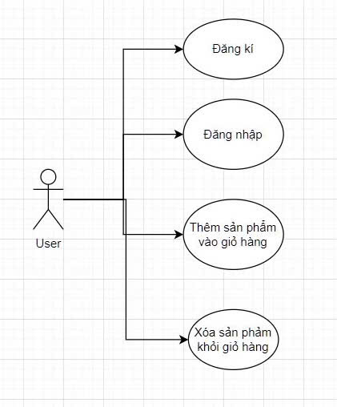

E-Commerce Website
Giới thiệu
Đây là một trang web bán hàng trực tuyến được xây dựng bằng Laravel. Hệ thống cho phép người dùng đăng ký, đăng nhập, thêm sản phẩm vào giỏ hàng và xóa sản phẩm khỏi giỏ hàng.

Chức năng chính

Đăng ký và đăng nhập người dùng.

Hiển thị danh sách sản phẩm.

Thêm sản phẩm vào giỏ hàng.

Xóa sản phẩm khỏi giỏ hàng.

Cấu trúc cơ sở dữ liệu

Hệ thống sử dụng các bảng chính sau:

users: Lưu thông tin tài khoản người dùng.

products: Lưu thông tin sản phẩm.

cart_items: Lưu các sản phẩm được thêm vào giỏ hàng của từng người dùng.

sessions: Quản lý phiên đăng nhập của người dùng.

Hướng dẫn cài đặt
Clone repository:

git clone <repository-url>
cd <project-folder>
Cài đặt các dependency:

composer install
Cấu hình môi trường:

Tạo file .env từ .env.example.

Cấu hình kết nối cơ sở dữ liệu trong file .env.

Chạy migration để tạo bảng trong database:

php artisan migrate
Khởi động ứng dụng:

php artisan serve
Công nghệ sử dụng
Backend: Laravel

Database: MySQL

Frontend: Blade template engine (có thể nâng cấp lên Vue.js hoặc React)

Tác giả
Hà Nam Khánh-22010149

